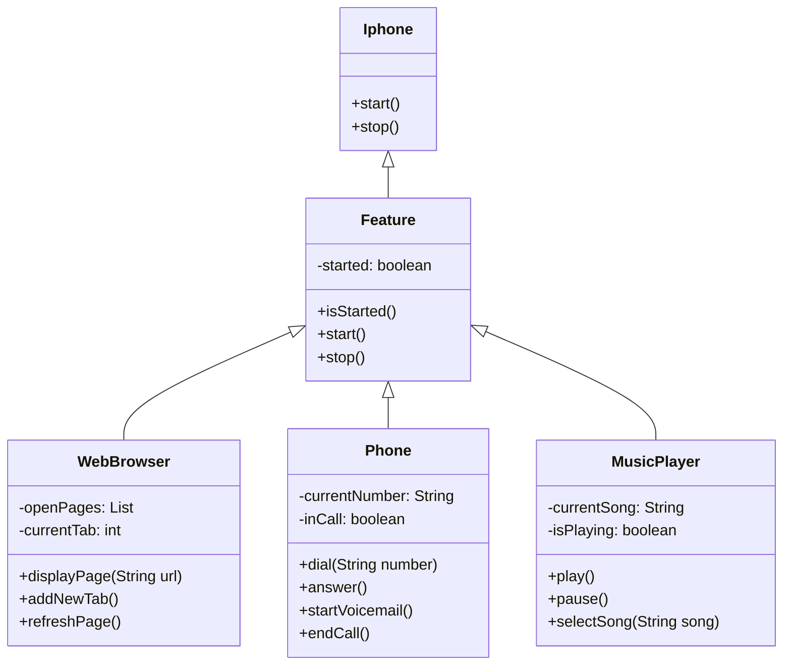

# Projeto POO iPhone Component

Este é um projeto que implementa funcionalidades básicas de um iPhone, incluindo um Reprodutor Musical, um Aparelho Telefônico e um Navegador na Internet.

## Funcionalidades Implementadas

### Music Player
- Método `play()`: Inicia a reprodução de uma música.
- Método `pause()`: Pausa a reprodução da música atual.
- Método `selectSong(String song)`: Seleciona uma música para reprodução.

### Phone
- Método `dial(String number)`: Liga para o número especificado.
- Método `answer()`: Atende uma chamada recebida.
- Método `startVoicemail()`: Inicia o serviço de correio de voz.
- Método `endCall()`: Encerra um ligação.

### Web Browser
- Método `displayPage(String url)`: Exibe uma página da web especificada pela URL.
- Método `addNewTab()`: Adiciona uma nova aba de navegação.
- Método `refreshPage()`: Atualiza a página atualmente exibida.

